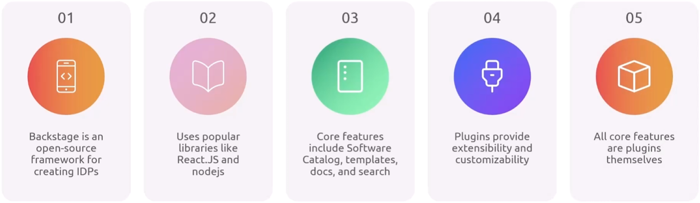

**Backstage is an opensource framework to build and provide internal developer portals.**
# Backstage's features:
- Catalog 
- Templates 
- Docs 
- Search 
- Plugins: provide extensibility and customizability 
