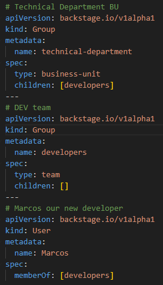

# Relationships between entities
First of all, a good thing that I like and made it so much easier for me to understand the relationships between entities is to have 2 groups of elements: 
1️⃣ Who owns things in Backstage ? 
**There could only be two inds of owners in Backstage, Users and Groups.** 
- You guessed it right, a Group can have multiple Users. 
- A User can be part of one or multiple Groups. 
- A Group can have one parent and many childs. 
- A Group could be a [team, business unit, product-area, root]. 

*Let's put a use case into action* 
*- Creating a Parent Group 'technical-department' *
*- Creating a  Child Group 'developers' member of 'technical-department' *
*- Creating a User 'Marcos' member of 'developers'* 

**Let's check them up in Backstage's catalog** 

**Let's check the "developers" group** 

**Let's check the "technical-department" group** 

**Let's filter to Users an check "Marcos"** 

