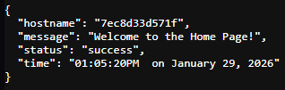
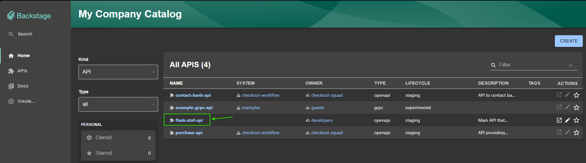
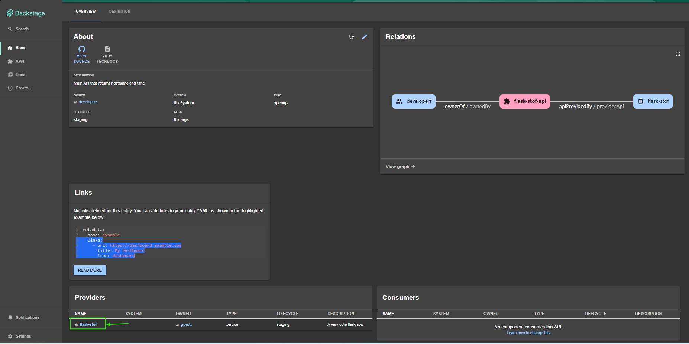
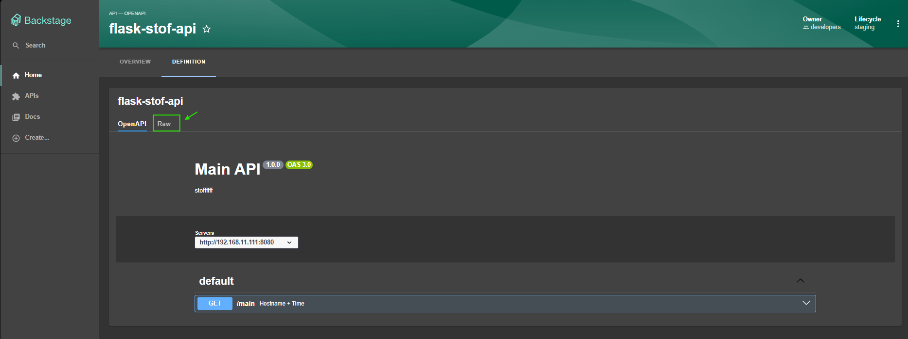
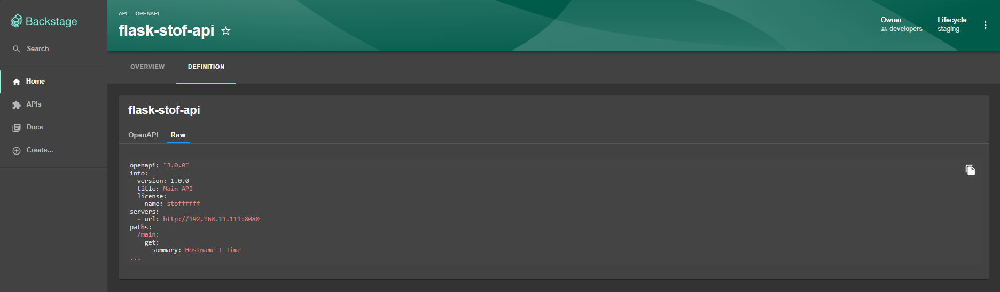

# API Spec & definition
#### Let's start a quick demo to showcase how backstage handles API's definitions and specs with class. 
###### NOTE: In the following example, I am using a very simple flask API that returns the hostname and time at the [GET] /main endpoint, result is shown as below ⬇️ 

#### In this case, the hostname is the container's Id since I am running it inside a docker container. 

#### We registred this sample API in backstage as an API called "flask-stof-api", check out the catalog-info.yaml here ⬇️ 
https://github.com/stoffffff/platform-engineering-with-backstage/blob/main/catalog-info.yaml

#### Let's take a look at backstage now: 

#### Click on it for more details. 

#### Note that it is provided by the flask-stof service, which is also a registred component in our backstage instance. 
#### Go to definition and check 'raw'. 

#### Result: 

#### Pretty clean and usefull for developers trying to figure out how a certain API works and what components it interacts with! 😁