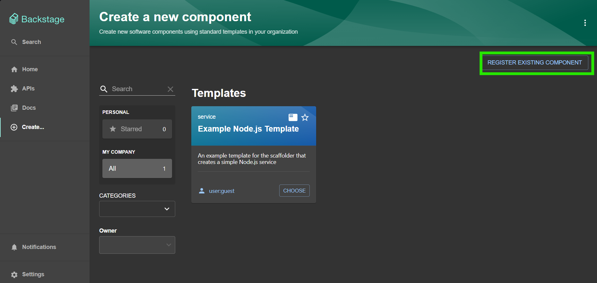
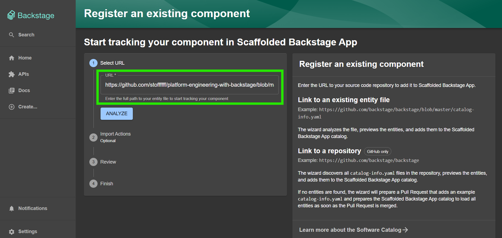

### Backstage is an opensource framework that helps platform engineers build internal developer portals.
# Backstage's features
- Catalog 
- Templates 
- Docs 
- Search 
- Plugins: provide extensibility and customizability 

# Backstage's catalog
- A **User** is an entity that represents a member of a certain Group (developer, business analyst, architect...). 
- A **Group** is a representation of one or multiple Users (team) who collaborate to achieve a certain goal inside and organisation. 
- A **Component** represents software or a piece of a distributed system that an organisaton wants to keep track of; eg. A Java or flask microservice. 
- A **System** is a logical grouping of multiple **APIs** or **Components** that achieve a software's organisational goal. Eg. 3 APIs that manage products in an ecommerce application; An API to upload an new product by an administrator or a warehouse employee, one that allows a customer to buy an product, and one that manages the lifecycle of a product (Available, Out of stock or No longer available). 
- A **Domain** is logical representation of entities (Groups and Users) alongside Systems, it represents a business inside an Organisation; eg. The e-banking domain: Teams, Components, APIs, Users... 
- A **Resource** is an infrastructure component on which API's/Components rely on in order to operate. Eg. An EC2 instance, an S3 bucket or a DynamoDB database.

# Registering components in Backstage
There are various methods in order to fill our catalog in Backstage: 
1️⃣ ​Registering a component manually: 
- Go to **/create** and hit the **REGISTER EXISTING COMPONENT** button 
- Backstage will expect to give it the url to the **catalog-info.yaml** file living inside your repository, it can be maintained by your organisation or by an external entity. 

***Paste the url to that file, then hit analyze*** 

PS: You can find the url of the example file used in this demo here: 
https://github.com/stoffffff/platform-engineering-with-backstage/blob/main/catalog-info.yaml 

2️⃣ Registering via Backstage templates: 
- Every software registered via backstage's templates is automatically saved in the catalog. 

3️⃣​ Static registeration:  
- We can also throw some yaml lines to our backstage instance's configuration file in order to register components. 

4️⃣ Automatically fetching entities from a github organization: 
- We will talk about this topic in the integrations section. 

###### Please find the next lecture here: https://github.com/stoffffff/backstage-docs/blob/main/backstage-catalog/relationships.md
                                          
