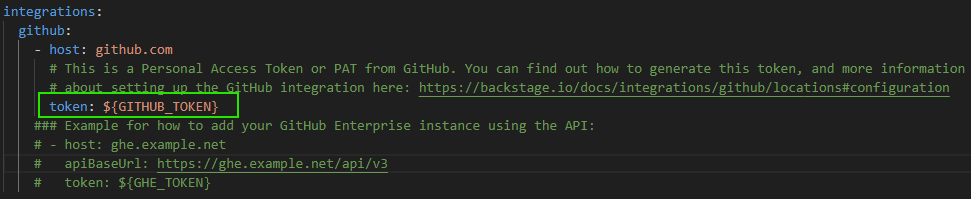
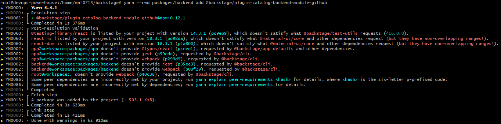
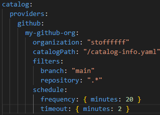
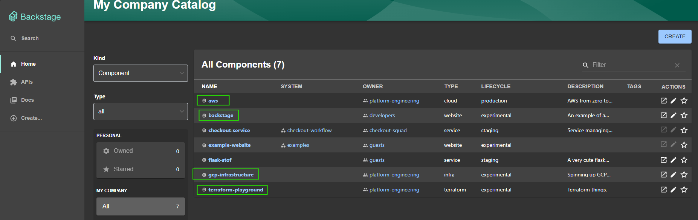

# How does Backstage handle integrations ?
#### For the previous examples, we saw how backstage is pretty efficient at gathering data from our organization's repository and creates a useful UI based on that data, but what if i want backstage to update its catalog with private repository ? Well you need to create a github personal access token and hand it over to Backstage. 

#### For people who are not familiar with github's personal access token, here are the official docs from github itself ⬇️ 
###### https://docs.github.com/en/authentication/keeping-your-account-and-data-secure/managing-your-personal-access-tokens 

#### Once you created your personal access token, you can give it to backstage in very simple step: 
- Either you hardcode it (since it is your local config file and never pushed to the origin) ***NOT RECOMMENDED*** 
- Or you pass it as an environment variables as below ⬇️ 

#### Once done, backstage can access your private repository and fetch the catalog infos. 

# What if my organization have multiple repositories, new repos are created frequently and we don't want to update our backstag's config everytime a new repo is created ? 

#### Backstage handles it with class, all you have to do is to follow these simple steps ⬇️ 

1️⃣ You need to install the github-catalog pulugin, as it is not installed in the initial backstage instance: 
- yarn --cwd packages/backend add @backstage/plugin-catalog-backend-module-github ***(from your backstage root directory)*** 

- then, update your index.ts ***(packages/backend/src/index.ts)*** 
**backend.add(import('@backstage/plugin-catalog-backend'));** 
**backend.add(import('@backstage/plugin-catalog-backend-module-github'))** 

- Restart your backstage instance. 

2️⃣ Update your configuration file ***(app-config.yaml)*** 

#### Since backstage already has our personal access token, it will fetch our organization periodically for new entities, the added config above basically says the following: 
- Every 20 minutes, scan my github organization named "stoffffff", (the host and token are already in your hands right ? 😅), and check for a file called "catalog-info.yaml. Once you have it, I am sure you will understand what you should do next (ps: he will register the new entity in the catalog 😉).

#### Backstage now automatically pulled new entities from my github account! 

