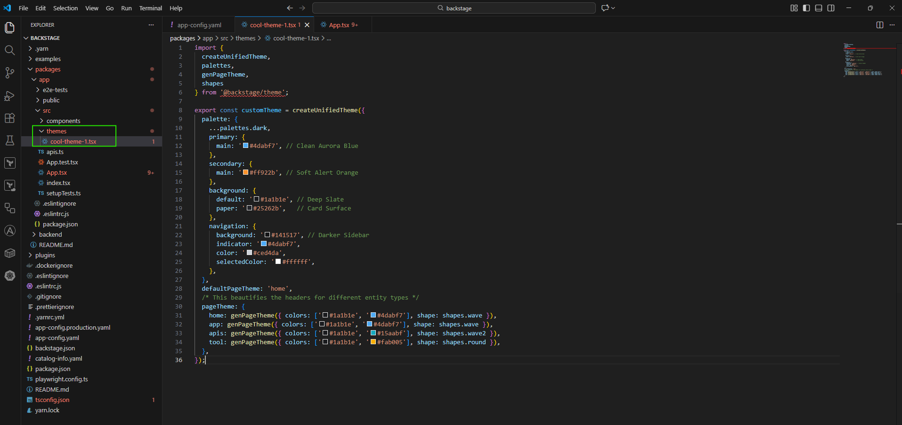
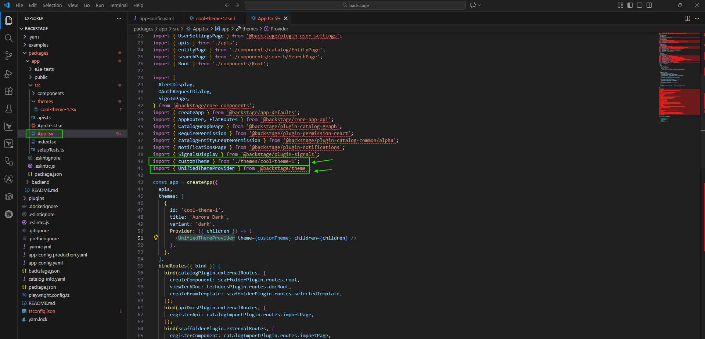
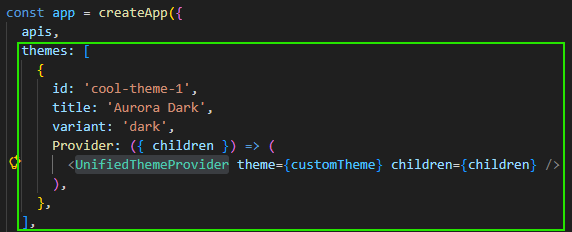
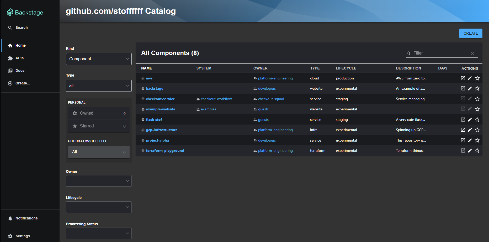

# UI-customization for Backstage
#### Let's change our Backstage's look from the "stock-spotify" theme to a new one. 
#### Step 1: Create a Theme File 
Create a new file at ***"packages/app/src/theme/"***, in this case I named it ***cool-theme-1.tsx***. 

#### Step 2: Register the Theme in App.tsx 

Don't forget those imports. 

#### Let's check our UI now. 

Clean ! I like it. 😁 
