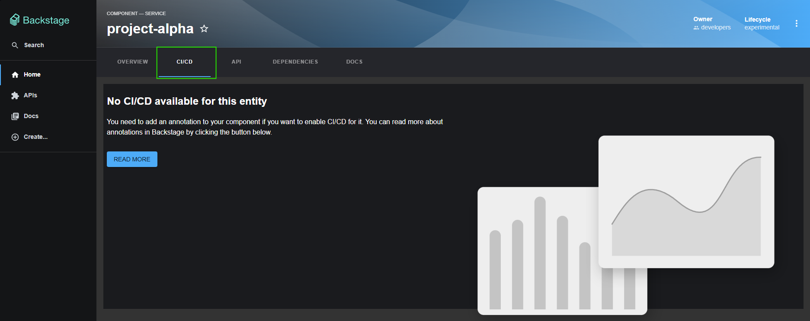
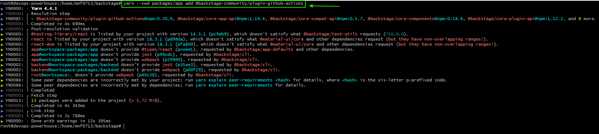
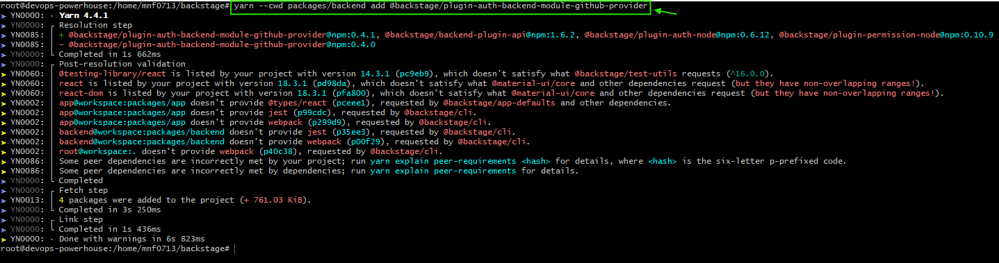
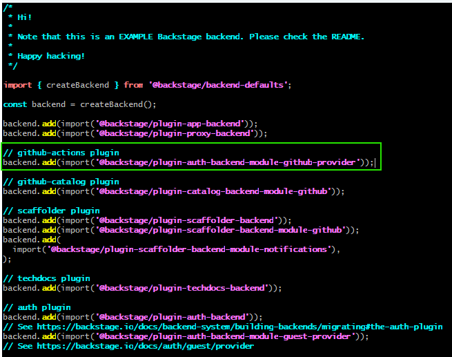
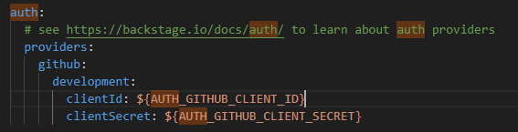
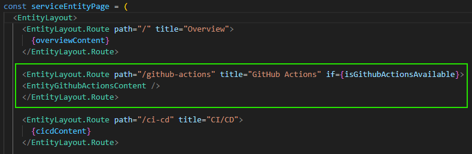
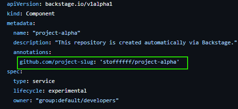
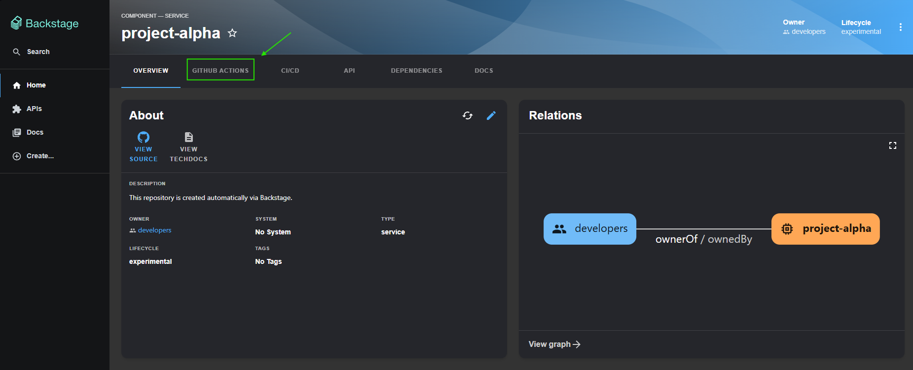
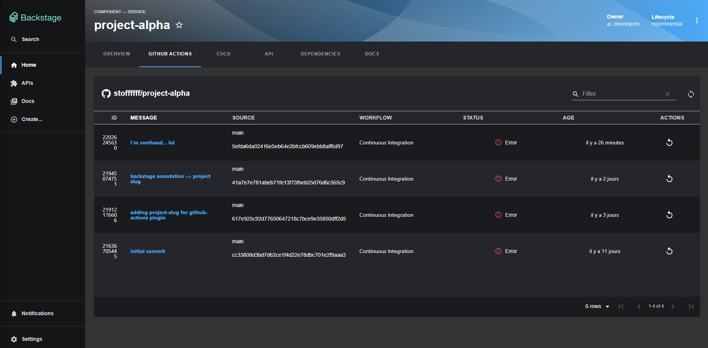

# What is a plugin in Backstage ?
In Backstage, Plugins are the fundamental building blocks of the platform. In fact, Backstage is entirely "plugin-driven"—almost everything you see, from the Software Catalog to TechDocs, is actually an individual plugin. 
A Plugin is a self-contained, modular npm package that adds specific functionality or integrations to your developer portal. They can be frontend-only (UI components), backend-only (APIs and logic), or a combination of both. 

# Adding a plugin in Backstage
Let's take for example my component "project-alpha", we can see a tab CI/CD in the catalog, but if we click to check it shows the following page 🔽 

This means that we need to add the github-actions plugin (or gitlab if you're using it) in order to fetch our workflows' data, so let's do it ! 
- Go the official backstage plugins page and choose the plugin you want to integrate with your instance. 
In our case, it's the ***github-actions*** plugin. 
- So let's follow the steps of installation from their official repo. 🔽
https://github.com/backstage/community-plugins/tree/main/workspaces/github-actions/plugins/github-actions

#### STEP 1: Intalling packages
Adding the ***github-actions*** package. 
###### yarn --cwd packages/app add @backstage-community/plugin-github-actions 

Adding the ***github-auth-provider*** package (useful for authenticating to github). 
###### yarn --cwd packages/backend add @backstage/plugin-auth-backend-module-github-provider 

Importing the package in our index.ts file. 
###### backend.add(import('@backstage/plugin-auth-backend-module-github-provider')); 

#### STEP 2: Configuration
- Create an OAuth app in your github portal. Once done, get your ***client_id*** and ***client_secret***. 
- For dev purposes, I am gonna store them as environment variables. 
- Now, let's add this block into our config file ***app-config.yml***. 

Add the Github Actions button into your frontend, don't worry about the backend logic, the plugin will handle it for us :).  

Finally, annotate your component with a correct GitHub Actions repository and owner. 

Refresh, and check it out at your backstage instance. 

Click on Githyb-Actions button. Result:🔽 

Clean! You can check your workflows and rerun them if you want.

