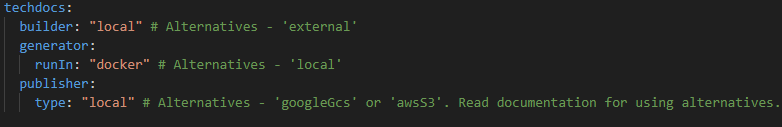
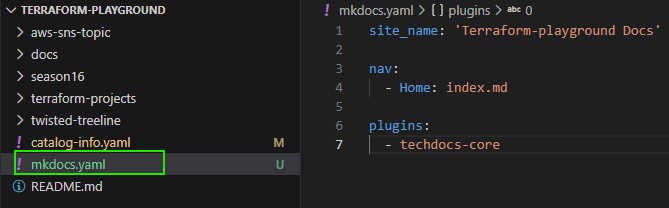
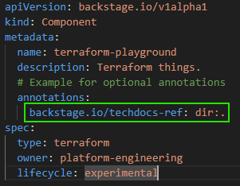
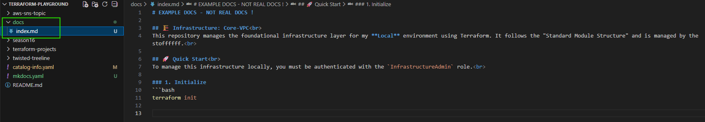
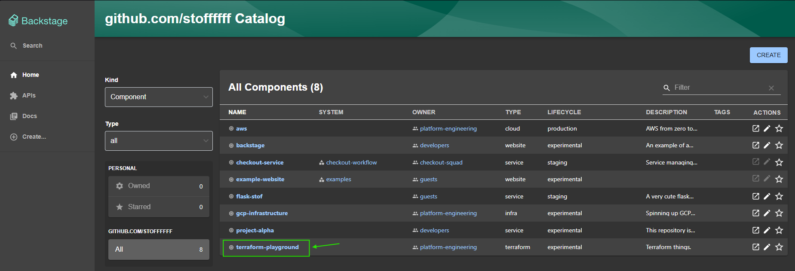
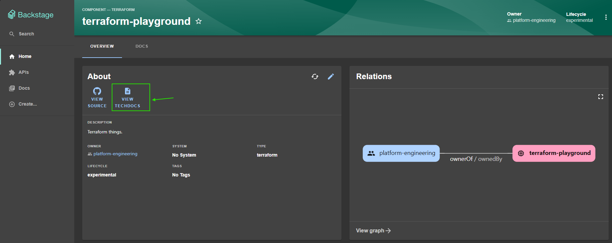
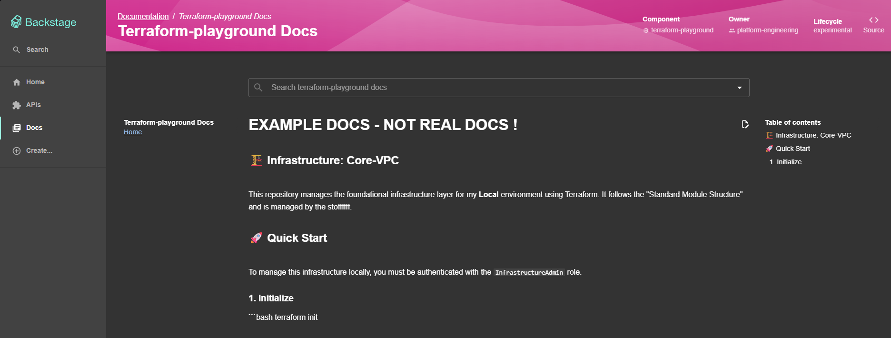

# What are techdocs ?
#### TechDocs is Backstage’s "docs-like-code" solution. 
It allows engineers to write documentation in Markdown files that live directly inside their service's source code repository. Backstage then automatically fetches, transforms, and renders those files into a beautiful, centralized documentation site within the portal. 
#### The utility: 
Centralization: No more hunting through Confluence, Notion, or READMEs across 100 different repos. All docs are in one place. 
Ownership: Since the docs live in the code repo, the same developers who write the code maintain the documentation. 
Automation: It uses a "build once, view anywhere" approach—typically using MkDocs under the hood to generate the final HTML. 

#### Hands-on example: 
#### STEP 1️⃣ 
In ***app.config.yaml*** file, the following config tells Backstage how to handle the documentation of components. 

#### What does that mean ? 
#### builder: "local": The Backstage backend is responsible for "preparing" the docs (fetching the Markdown files from your Git provider) whenever a user tries to view them. 
#### generator: runIn: "docker": To convert Markdown to HTML, Backstage will spin up a Docker container (usually spotify/techdocs) containing MkDocs. This keeps your host machine clean but requires Docker to be installed on the server. 
#### publisher: type: "local": Once the HTML is generated, it is stored on the local file system of the Backstage server rather than a cloud bucket (like S3 or GCS). 

### IMPORTANT: 
- This is best for local development, small teams, or "Proof of Concept" (PoC) setups. 
- This is not ideal for Production. 
- The config in the screenshot above is the default one that you will find if you download Backstage from their official git repository.  

#### STEP 2️⃣ 
#### Let's enable docs for one of our components already registered in Backstage. 
To do so, we should add a file called ***mkdocs.yml*** in the root directory of our component's source code.   

#### STEP 3️⃣ 
#### Now, we should tell Backstage where to find the docs, as below ⬇️ 

This informs Backstage to expect the folder "docs" containing all the ***.md files*** in the root of the source code. PS: Backstage automatically looks for a folder called ***"docs"***. 

After filling the ***docs*** folder with some ***.md files***, the result should look something like this ⬇️ 

#### Now, let's commit our stuff and check if the component now has techdocs from our Backstage instance. 
We select our component "terraform-playground" ⬇️ 

Notice that now, we can hover the ***view techdocs*** button since we onboarded our component on techdocs ***(the mkdocs.yml file 😉)*** ⬇️ 

Click "VIEW TECHDOCS". 

#### Bingo!

