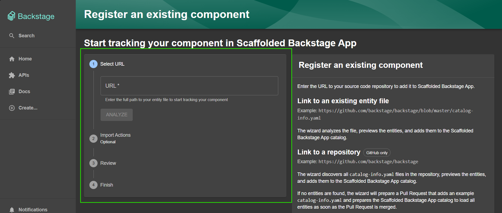
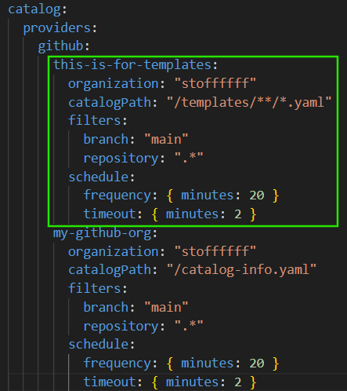
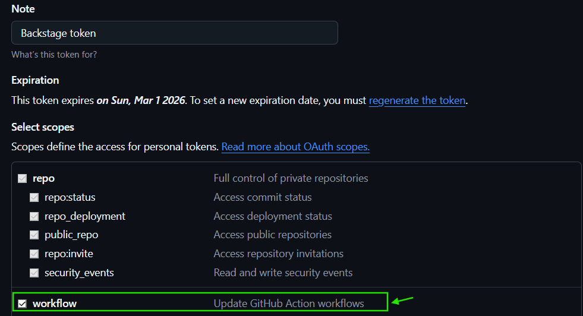
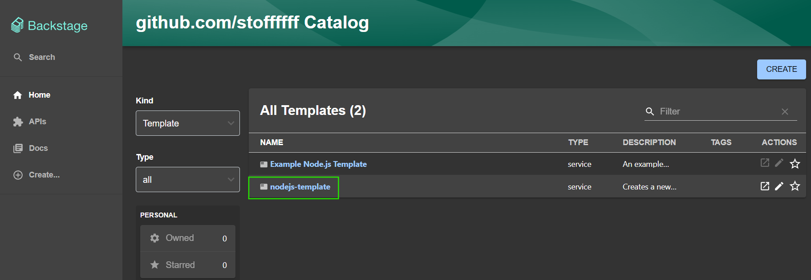
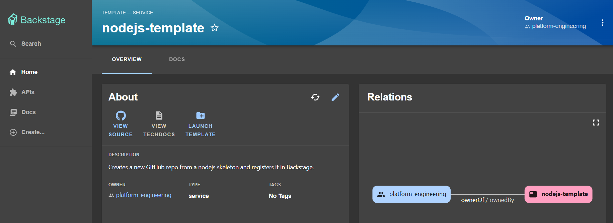
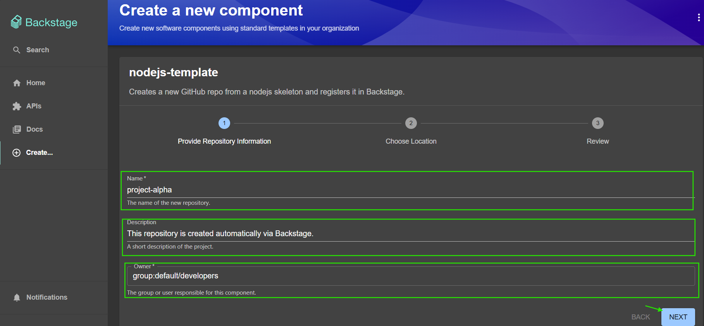
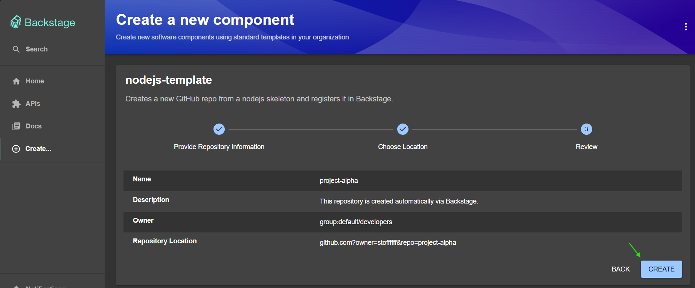
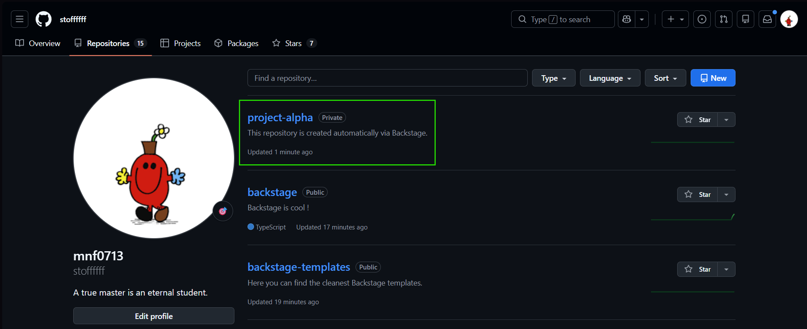
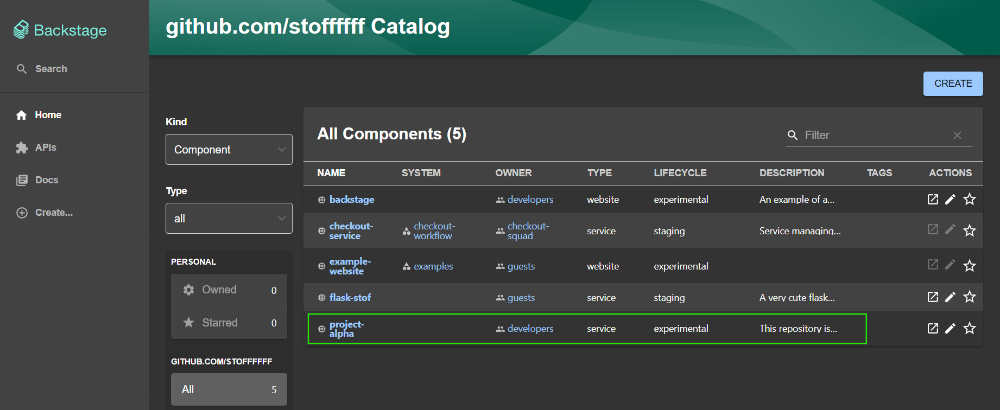

# What are templates in backstage ?
#### The Brief Definition 
A Template is a predefined, automated blueprint that allows developers to create new projects, documentation, or infrastructure components with a few clicks. It consists of a **template.yaml** file that defines a web form (to collect user input) and a series of steps (to execute actions). 

#### Are they really useful ? 
Let's break down what they are used for: 
- Self-Service Onboarding: Developers don't have to wait for DevOps to provision a repo, a CI/CD pipeline, or a cloud resource. They just fill out a form, and the template does the "heavy lifting." 
- Enforcing "Golden Paths": You can bake in security best practices, standard libraries, and observability tools by default. If it’s easier to use the template than to build from scratch, developers will naturally follow the standards. 
- Reduced Cognitive Load: A developer doesn't need to remember how to configure your company’s specific Jenkins pipeline or which version of the internal auth library to use—the template handles the boilerplate. 
- Consistency: Every new microservice looks, feels, and deploys exactly like the others, making it easier for SREs to support them later. 

# Using templates
#### In the following demo, we will create a template that creates a dummy github repo that will be used for a new development need. The developers will provide some input using the template's form. We will go step by step: 
#### There are different ways to register a template in Backstage. Remember that a template is an entity itself, so it is not that much different from components when it comes to registering new ones. 

#### 1️⃣ Registering from the UI: 
- Click on: **"REGISTER AN EXISTING COMPONENT"** from the UI. 
- Fill in the form (link to your .yaml file) 

- Hit create! 

#### 2️⃣ Setting Backstage to automatically fetch new templates from one of your organization's repositories ***This will be the method used in this demo***. 
- Start by adding this configurtion to your **app.config.yaml** file 

#### Same as for components, this config tells backstage to fetch in my organization's repositories for any **.yaml** file that is under the following path ***/templates/ANY_SUBDIRECTORY***. 

- Take a look at the template code here ⬇️ 
###### https://github.com/stoffffff/backstage-templates/blob/main/templates/nodejs-template.yaml 

- Take a look at the nodejs squeleton here ⬇️ 
###### https://github.com/stoffffff/backstage-nodejs 

#### In the previous steps, Backstage will pull the squeleton repo, overrides the variables with the data given by the developers while filling up the template's forms, then it will create a new repository in github and returns it's link. 

#### IMPORTANT: Since we will use github actions workflow, we should update the basic token we passed to backstage, remember that our token only had repository permissions right ? We need to give it an other permission in order to run github actions workflows. 

#### Now, let's act as a developer and try to use this template and see the outcome.  

#### Note that Backstage automatically fetched our nodejs template form my github organization ⬇️ 

Now, let's use it! 

Fill the form with your data then hit next. 

Review your informations, then hit **Create** when ready! 

Let's check our github account now: 

#### Note that Backstage automatically created the ***"project-alpha"*** repository. 

#### Note that Backstage also registered the new repository as a component in the catalog! 

###### Please find the next lecture here ⬇️ 
###### https://github.com/stoffffff/backstage-docs/blob/main/backstage-techdocs/techdocs.md

